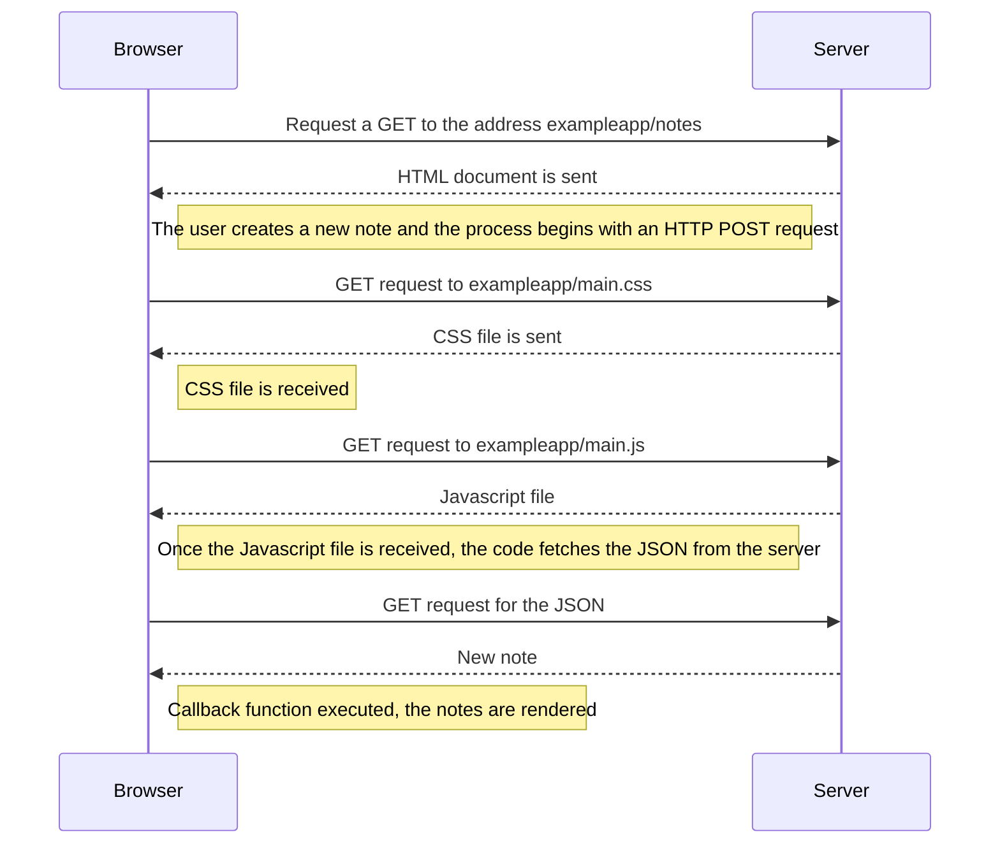

```mermaid
sequenceDiagram
    participant Browser
    participant Server

    Browser->>Server: Request a GET to the address exampleapp/notes
    Server-->>Browser: HTML document is sent
 
    Note right of Browser: The user creates a new note and the process begins with an HTTP POST request

    Browser->>Server: GET request to exampleapp/main.css
    Server-->>Browser: CSS file is sent

    Note right of Browser: CSS file is received 
    
    Browser->>Server: GET request to exampleapp/main.js
    Server-->>Browser: Javascript file

    Note right of Browser: Once the Javascript file is received, the code fetches the JSON from the server

    Browser->>Server: GET request for the JSON
    Server-->>Browser: New note

    Note right of Browser: Callback function executed, the notes are rendered

```
